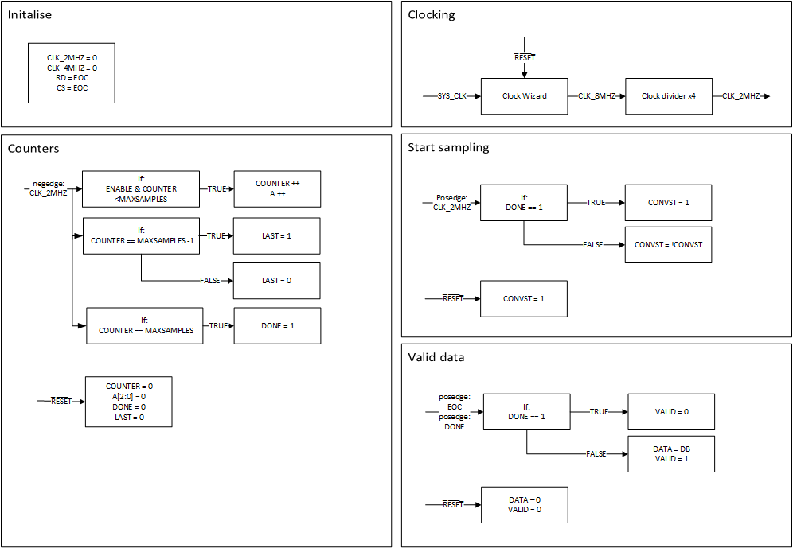

# FPGA_ADC_interface
interface to collect data from ADC and output in a format so can be stored in memory

# System Diagram

# State Diagram

# Good to know
- 3.3v IO Voltage
- Gist of interface
  - C̅S̅ and R̅D̅ connect to E̅O̅C̅
  - C̅O̅N̅V̅S̅T̅ pull low to start conversion
  - A0 to A2 put next channel address on bus
  - E̅O̅C̅ pulses low to show conversion complete
- [AD7829-1 Data sheet](https://www.analog.com/media/en/technical-documentation/data-sheets/AD7829-1.pdf)

| Pin | Description |
| ------ | ------ |
| C̅O̅N̅V̅S̅T̅ | Logic Input Signal. The convert start signal initiates an 8-bit analog-to-digital conversion on the falling edge of this signal. The falling edge of this signal places the track/hold in hold mode. The track/hold goes into track mode again 120 ns after the start of a conversion. The state of the C̅O̅N̅V̅S̅T̅ signal is checked at the end of a conversion. If it is logic low, the AD7829-1 powers down (see the Operating Modes section). |
| E̅O̅C̅ | Logic Output. The end of conversion signal indicates when a conversion has finished. The signal can be used to interrupt a microcontroller when a conversion has finished or latch data into a gate array (see the Parallel Interface section). |
| C̅S̅ | Logic Input Signal. The chip select signal is used to enable the parallel port of the AD7829. This is necessary if the ADC is sharing a common data bus with another device. |
| R̅D̅ | Logic Input Signal. The read signal is used to take the output buffers out of their high impedance state and drive data onto the data bus. The signal is internally gated with the C̅S̅ signal. Both R̅D̅ and C̅S̅ must be logic low to enable the data bus. |
| A2 to A0 | Channel Address Inputs. The address of the next multiplexer channel must be present on these inputs when the R̅D̅ signal goes low. |
| DB7 to DB0 | Data Output Lines. They are normally held in a high impedance state. Data is driven onto the data bus when both R̅D̅ and C̅S̅ go active low. |

# To-do
* Check if the address bits need looping back to 0 when it gets to 7

